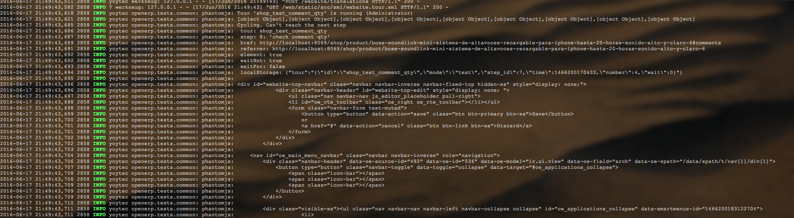
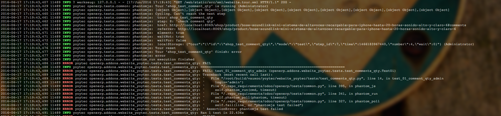

.. image:: https://img.shields.io/badge/licence-AGPL--3-blue.svg
    :alt: License: AGPL-3

Tour Disable DOM Log
====================

A simple patch that disables the log of the entire dom on PhantomJS
when a tour fails.

Before
------

After
-----

Usage
-----

Just install the module, it depends directly from web module.

Contributors
------------

* Oscar Alcala <oscar@vauxoo.com>

Maintainer
----------

.. image:: https://www.vauxoo.com/logo.png
   :alt: Vauxoo
   :target: https://vauxoo.com

This module is maintained by Vauxoo.

a latinamerican company that provides training, coaching,
development and implementation of enterprise management
sytems and bases its entire operation strategy in the use
of Open Source Software and its main product is odoo.

To contribute to this module, please visit http://www.vauxoo.com.
